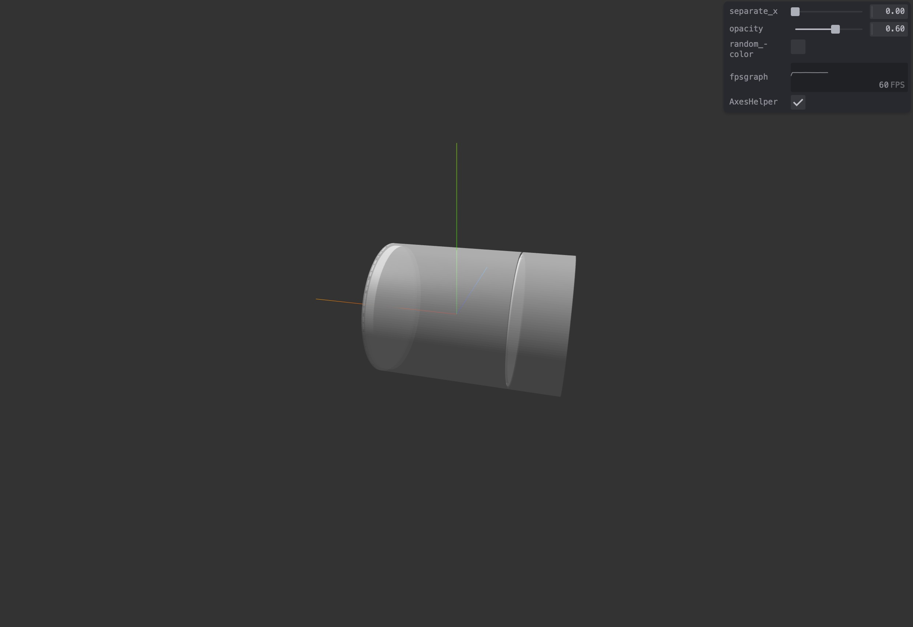

# Threejs-GDML-loader
This is the `GDML` file loader for the new version of `three.js`.  
Based on the work of [tpmccauley](https://github.com/tpmccauley).
## Installation
```
pnpm i threejs-gdml-loader
```
## Usage
``` ts
import {GDMLLoader} from "threejs-gdml-loader"

gdmlLoader = new GDMLLoader();
gdmlLoader.load("path-to-asset", (object)=>{
    scene.add(object);
});
```
## Demo
 
## Tips
This version is still under development. Only simple geometry import has been tested so far.
